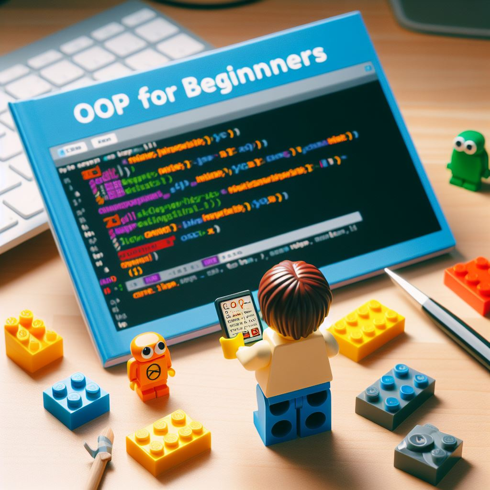

    

# POO para Iniciantes: Como Programar como um Mestre Lego 

## O que é Programação Orientada a Objetos?

É como brincar com Lego! 🧱
Você cria “peças” chamadas objetos.
Cada objeto tem atributos (como cor, tamanho) e comportamentos (o que ele faz).
A POO ajuda a organizar e reutilizar código.
Conceitos de Programação Orientada a Objetos:

**Classes:** São como moldes para criar objetos.

**Objetos:** São as coisas criadas a partir desses moldes.

**Atributos:** São as características dos objetos.

**Métodos:** São as ações que os objetos podem fazer.

## Herança:

Imagine uma família: avô, pai, filho.

A herança permite que uma classe “filha” herde características da classe “pai”.

Exemplo: “Carro” herda de “Veículo”.

## Polimorfismo:

Poli-o quê? 🤔
É como um disfarce mágico! 

Um método pode se comportar de maneiras diferentes em classes diferentes.

Exemplo: “Animal” pode fazer “barulho”, mas cada animal faz um som diferente.

## Encapsulamento:

É como uma caixa trancada 🔒.

Protege os detalhes internos de uma classe.

Só os métodos da própria classe podem mexer nesses detalhes.

## Exemplos:

Imagina um jogo de videogame: personagens, inimigos, itens.

Cada um é um objeto com suas próprias regras.

POO ajuda a criar sistemas mais organizados e flexíveis! 🚀

`Muito obrigado por explorar o nosso artigo sobre Programação Orientada a Objetos! Esperamos que você tenha se divertido aprendendo como programar como um verdadeiro mestre Lego. Agora, é hora de colocar as mãos no código e criar suas próprias criações incríveis! Se tiver alguma dúvida ou quiser compartilhar suas experiências, deixe um comentário abaixo. Vamos construir juntos!😊`

Ilustrações e conteúdo gerados pela IA Copilot com a revisão humana.

[def]: 